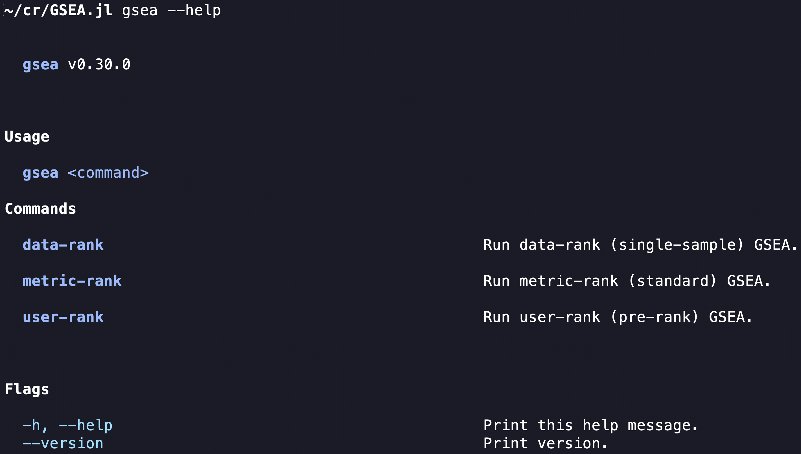

# Gene set enrichment analysis (GSEA) 🏔️

This is the new GSEA.

We have reimplemented the `S0` and `S0a` algorithms.
They run 1,000 times faster, reproduce all results, and create prettier plots.

We also developed a new `D2` algorithm.
It uses information theory to provide the most accurate, interpretable, and robust gene-set scores.

## Install

```zsh
git clone https://github.com/GSEA-MSigDB/GSEA.jl

cd GSEA.jl

julia --project
```

```julia
]build
```

Find the executable at `~/.julia/bin/gsea`.

## Use command-line interface

```zsh
gsea --help
```



Run the sarcopenia example

```zsh
gsea metric-rank \
    ~/Downloads \
    in/target2.tsv \
    in/data2.tsv \
    in/set2.json \
    --number-of-permutations 10 \
    --more-plots "WP_DNA_MISMATCH_REPAIR;WP_CELL_CYCLE"
```

## Use julia functions

See `test` for examples.

## Contact us

If you have questions, issues, or suggestions, please [open a GitHub issue](https://github.com/GSEA-MSigDB/GSEA.jl/issues/new/choose).

Every report makes GSEA better.

---

Made by [Kata](https://github.com/KwatMDPhD/Kata.jl) ✅
